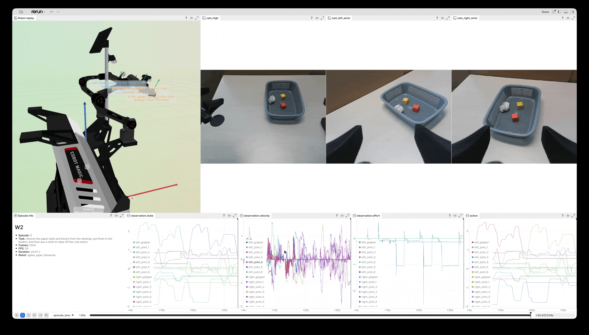
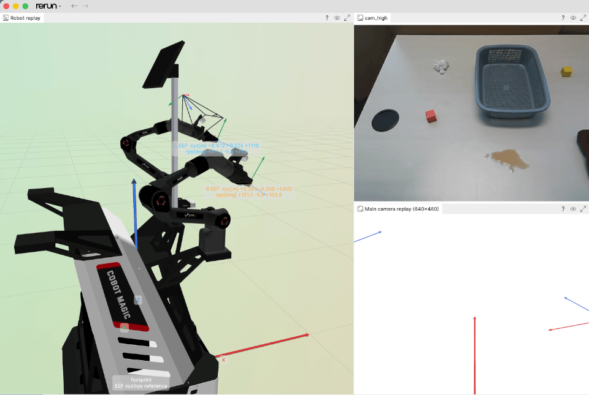

# 使用 Rerun 可视化 LeRobot 数据集

[English](README.md) | 中文

这是一个面向本地 [LeRobot](https://github.com/huggingface/lerobot) 数据集的可视化与媒体处理工具集。项目使用 [Rerun](https://rerun.io/) 在同一时间轴上同步展示多相机视频、数值信号、机器人运动学、末端轨迹和标定相机视图。

仓库在 [`assets/example`](assets/example) 中提供了三个精简的 LeRobot v3.0 示例，无需下载完整基准数据集即可运行可视化。



## 功能

- 读取本地 LeRobot v3.0 和 v2.1 数据集。
- 在 `episode_time` 时间轴上同步 RGB/深度视频与数值特征。
- 根据数据自动使用 URDF 回放 Piper/ALOHA 和 RoboTwin/Arx5 关节状态。
- 对暂不支持机器人模型的 embodiment（例如示例中的 LIBERO/Franka）显示视频和数值信号。
- 根据 OpenCV 外参重建固定标定相机视角。
- 将结果保存为可移植的 Rerun `.rrd` 记录，而不启动查看器。
- 将 episode 导出为相机拼图或独立 MP4 文件。
- 将合并存储的 LeRobot v3.0 数据集转换为逐 episode 的 v2.1 布局。

## 快速开始

### 1. 克隆仓库

```bash
git clone https://github.com/Livioni/Lerobot_Datasets.git
cd Lerobot_Datasets
```

### 2. 安装环境

以下命令会创建本项目测试使用的 Conda 环境。MP4 导出和 v3.0→v2.1 转换会使用 FFmpeg。

```bash
conda create -n rerun -c conda-forge python=3.10 ffmpeg -y
conda activate rerun

python -m pip install \
  "rerun-sdk==0.35.0" \
  "numpy>=2.0,<3" \
  "pyarrow>=21,<26" \
  "Pillow>=11,<13" \
  "huggingface_hub>=1.0,<2"
```

这些脚本不依赖 `lerobot` Python 包，而是通过 PyArrow 直接读取 LeRobot 文件。

### 3. 下载机器人模型

从 Hugging Face 下载 [`HarrisonPENG/Embodiments`](https://huggingface.co/datasets/HarrisonPENG/Embodiments)，并直接保存到 `embodiments/`：

```bash
hf download HarrisonPENG/Embodiments \
  --repo-type dataset \
  --local-dir embodiments
```

下载后的目录应包含：

```text
embodiments/
├── aloha-agilex/
├── aloha_new_description/
├── realsense2_description/
└── tracer2_description/
```

如果仓库为公开状态，则无需登录即可下载；如果访问需要令牌，请先执行 `hf auth login`。使用 `--no-robot` 时可以不下载机器人模型。

### 4. 运行内置示例

#### LIBERO：Franka 视频与数值信号

[`assets/example/LIBERO`](assets/example/LIBERO) 包含 episode 0，共 214 帧、20 FPS 和两路 RGB 相机。

```bash
python visualize_lerobot_rerun.py \
  --root assets/example/LIBERO \
  --episode 0 \
  --no-robot
```

#### RoboTwin：完整 Arx5 机器人与 RGB-D 相机

[`assets/example/RoboTwin2`](assets/example/RoboTwin2) 包含 episode 0，共 180 帧、15 FPS、三路 RGB、三路深度视频和 14 维双臂状态。脚本会自动选择完整 Arx5 模型。

```bash
python visualize_lerobot_rerun.py \
  --root assets/example/RoboTwin2 \
  --episode 0
```

#### Agilex-Aloha：Piper 双臂机器人

[`assets/example/W2`](assets/example/W2) 包含 episode 0，共 1,034 帧、30 FPS、三路 RGB 相机，以及 14 维位置、速度、力矩和动作信号。脚本会自动回放前方两只 Piper 机械臂和夹爪。

```bash
python visualize_lerobot_rerun.py \
  --root assets/example/W2 \
  --episode 0
```

| 示例 | Robot type | 帧数 | 相机 | 机器人回放 |
| --- | --- | ---: | --- | --- |
| LIBERO | `franka` | 214 | 2 路 RGB | 仅视频/信号 |
| RoboTwin2 | `unified_robot` | 180 | 3 路 RGB + 3 路深度 | 完整 Arx5 |
| W2 | `agilex_piper_bimanual` | 1,034 | 3 路 RGB | Piper 前方双臂 |

## 可视化自己的 LeRobot v3.0 数据

`--root` 可以指向一个数据集，也可以指向直接包含多个数据集子目录的文件夹：

```bash
python visualize_lerobot_rerun.py \
  --root /path/to/datasets \
  --dataset dataset_directory_name \
  --episode 0
```

省略 `--dataset` 时，脚本会自动选择唯一的数据集；如果发现多个数据集，则显示交互式选择菜单。只检查数据集发现结果而不启动 Rerun：

```bash
python visualize_lerobot_rerun.py \
  --root assets/example \
  --list-datasets
```

## 机器人回放与 Embodiment 模型

v3.0 可视化脚本目前识别两类状态配置：

- `agilex_piper_bimanual`：每侧需要六个关节值和一个夹爪值。默认使用 `embodiments/aloha_new_description/urdf/aloha_tracer2_dabai_dark.urdf`，并依赖 `tracer2_description` 中的底盘网格。
- `unified_robot`：使用 RoboTwin/Arx5 的 14 维状态布局。默认使用 `embodiments/aloha-agilex/urdf/arx5_description_isaac.urdf`，显示完整底盘、轮组、相机和前后四臂。

其他机器人类型仍可通过 `--no-robot` 完整查看视频和数值信号。

可视化进程会将 `embodiments/` 软件包目录加入 `ROS_PACKAGE_PATH`，使 Rerun 能够解析 `package://` 网格路径。脚本不会修改原始 URDF，而是创建临时可视化副本，并仅从副本中移除碰撞模型。

数据中的 `left_gripper` 和 `right_gripper` 表示两根指爪之间的总开度，单位为米。回放时会把总开度均分到两侧，使指爪保持原始尺寸并对称开合。

`realsense2_description` 只供可选的 D435/D415 等 URDF 版本使用；默认 Piper Dabai 模型和默认 Arx5 模型都不依赖它。

## 标定相机视角回放

使用 [`caliberations/w2_demo.yaml`](caliberations/w2_demo.yaml) 中的标定，从固定主相机视角查看 W2 示例：

```bash
python visualize_lerobot_rerun.py \
  --root assets/example/W2 \
  --episode 0 \
  --camera-calibration caliberations/w2_demo.yaml \
  --camera-resolution 480 640
```



YAML 中的 `extrinsic` 按以下方式解释：

```text
p_camera = T_camera_base @ p_base
```

它会把机器人 `footprint` 坐标系中的点转换到 OpenCV 相机坐标系（`+X` 向右、`+Y` 向下、`+Z` 向前）。脚本会求逆得到相机在 base 坐标系中的位姿。Rerun 首先打开 `Main camera replay (640x480)` 标签页，同时保留自由视角的 `Robot replay` 标签页用于对照。

`--camera-resolution` 的参数顺序为 `HEIGHT WIDTH`。当标定文件中只有一个相机时，脚本会自动推断 `--camera-feature`。